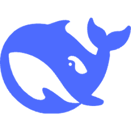

<p align="center">
  
</p>

<h1 align="center">DeepSeek Monitor</h1>

<p align="center">
  <a href="README.md">English</a>
</p>

<p align="center">
  一只住在菜单栏里的小鲸鱼，帮你盯着 DeepSeek 的余额。
</p>

<p align="center">
  
  
  
</p>

---

## 为什么做这个

你每天都在用 DeepSeek。剩余多少额度，不该是个需要打开浏览器、跑脚本、专门去看的事情。

它就应该*在那儿*，在菜单栏里，抬头就能看见。

---

## 它能做什么

菜单栏里一个安静的小存在。

- **余额一目了然** -- DeepSeek 剩余额度，始终可见
- **自动刷新** -- 从 15 秒到任意间隔，随你设置
- **安全可靠** -- API Key 存储在 macOS 钥匙串中，不写文件
- **高度自定义** -- 图标、文字、颜色、大小、字重，随心所欲
- **一条鲸鱼** -- 手绘风格的渐变小鲸，带水柱动画，因为细节值得

---

## 开始使用

### 📥 方式一：下载预编译版本 (推荐)

1. 前往 **[Releases](https://github.com/yourname/ds-mon/releases)** 页面。
2. 下载最新的 `ds-mon.zip` 并解压。
3. 将 `DeepSeek Monitor.app` 拖入你的 **应用程序 (Applications)** 文件夹。
4. **重要**：由于应用未经过 Apple 签名，首次打开时可能会提示“无法验证开发者”。
   - 请在 `应用程序` 文件夹中找到它，**右键点击**应用，选择 **打开**。
   - 在弹出的对话框中再次点击 **打开** 即可。

### 🛠️ 方式二：从源码构建

如果你是开发者，可以手动构建：

```bash
git clone https://github.com/yourname/ds-mon.git
cd ds-mon
./scripts/build_app.sh
```
构建完成后，在 `dist` 目录下即可找到 `DeepSeek Monitor.app`。

---

## 系统要求

| | |
|---|---|
| 系统 | macOS 14 (Sonoma) 或更高版本 |
| 工具链 | Swift 6.0+ |
| API | DeepSeek API Key ([点此获取](https://platform.deepseek.com/)) |

---

## 项目结构

```
Sources/ds-mon/
├── Views/           # SwiftUI 视图
├── ViewModels/      # 基于 Observation 的状态管理
├── Services/        # API 客户端与钥匙串管理
├── Models/          # 数据模型
├── Extensions/      # 颜色主题、工具函数
└── Resources/       # 鲸鱼素材
```

纯 SwiftUI + Observation 构建，零第三方依赖。

---

## 自定义

菜单栏外观完全由你掌控：

- 显示/隐藏鲸鱼图标
- 显示/隐藏余额文字
- 自选图标和文字颜色
- 调整透明度、字号和字重
- 所见即所得，实时预览

---

## 安全

API Key 存储在 **macOS 钥匙串**中 -- 和你的密码同一套安全体系。不会明文落盘、不会记录日志、不会发送到 DeepSeek 以外的任何地方。

---

## 许可证

MIT

---

<p align="center">
  <sub>让小鲸鱼帮你盯着余额。</sub>
</p>
