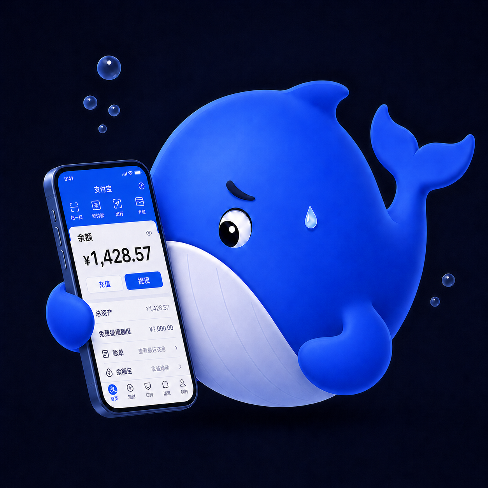
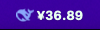
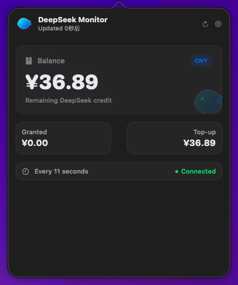
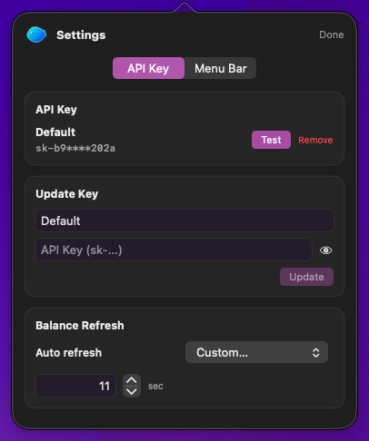
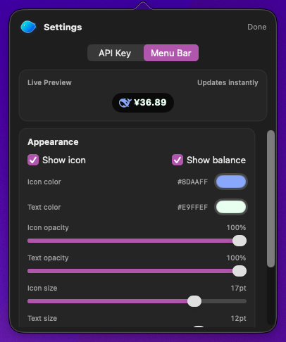

<p align="center">
  
</p>

<h1 align="center">DeepSeek Monitor</h1>

<p align="center">
  <a href="README-CN.md">中文</a>
</p>

<p align="center">
  A tiny whale that lives in your menu bar and watches your DeepSeek balance.
</p>

<p align="center">
  
  
  
</p>

---

## Why

You use DeepSeek every day. You should know how much credit is left -- without opening a browser, without running a script, without thinking about it.

The answer should just be *there*, in your menu bar, every time you glance up.

---

## What it does

A small, quiet presence in your macOS menu bar.

- **Balance at a glance** -- your remaining DeepSeek credit, always visible
- **Auto-refresh** -- configurable from 15 seconds to whenever you like
- **Flip animation** -- balance changes roll smoothly in the menu bar
- **Secure** -- API key stored in macOS Keychain, never in a file
- **Customizable** -- icon, text, color, size, weight -- make it yours
- **One whale** -- a hand-drawn gradient mascot in the app, plus a crisp menu bar icon for daily use

<p align="center">
  
</p>

<p align="center">
  
  
  
</p>

---

## Get started

### 📥 Option 1: Download Pre-compiled Version (Recommended)

1. Go to the **[Releases](https://github.com/Kevoyuan/ds-mon/releases)** page.
2. Download the latest `ds-mon.zip` and extract it.
3. Drag `DeepSeek Monitor.app` into your **Applications** folder.
4. **Important**: Since the app is not signed by Apple, you may see a "developer cannot be verified" warning or it might fail to open.
   - Locate the app in your `Applications` folder, **Right-click** it, and select **Open**.
   - Click **Open** again in the dialog to confirm.
   - **If it still doesn't open or says the app is damaged**, open your `Terminal` and run:
     ```bash
     xattr -cr "/Applications/DeepSeek Monitor.app"
     ```

### 🛠️ Option 2: Build from Source

If you are a developer, you can build it manually:

```bash
git clone https://github.com/Kevoyuan/ds-mon.git
cd ds-mon
./scripts/build_app.sh
```
After building, you will find `DeepSeek Monitor.app` in the `dist` directory.

---

## Requirements

| | |
|---|---|
| System | macOS 14 (Sonoma) or later |
| Toolchain | Swift 6.0+ |
| API | DeepSeek API key ([get one here](https://platform.deepseek.com/)) |

---

## Architecture

```
Sources/ds-mon/
├── Views/           # SwiftUI views
├── ViewModels/      # Observation-based state
├── Services/        # API client & Keychain
├── Models/          # Data types
├── Extensions/      # Color theme, helpers
└── Resources/       # Whale artwork
```

Built with **SwiftUI** and **Observation**. No third-party dependencies. Just Swift.

---

## Customization

The menu bar appearance is fully yours to shape:

- Show or hide the whale icon
- Show or hide the balance text
- Pick any color for icon and text
- Adjust opacity, size, and font weight
- Live preview updates as you tweak

---

## Security

Your API key is stored in the **macOS Keychain** -- the same system that protects your passwords. It is never written to disk as plaintext, never logged, never sent anywhere except the DeepSeek API.

---

## License

MIT

---

<p align="center">
  <sub>Let the little whale keep an eye on your balance.</sub>
</p>
